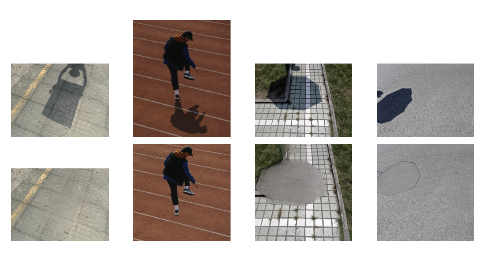
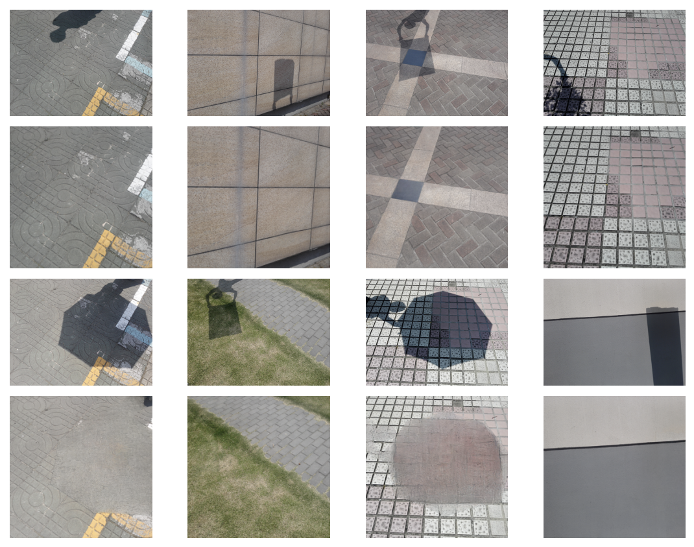
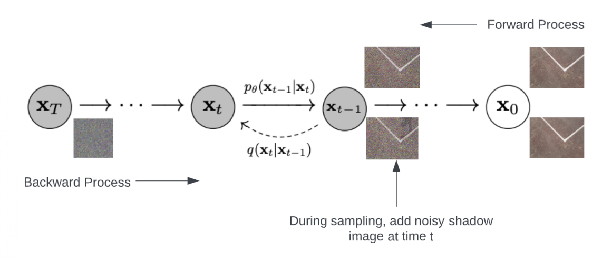
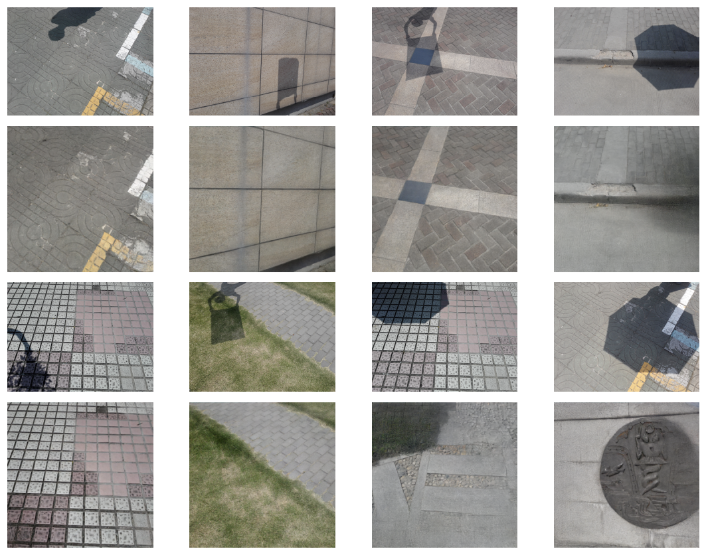

# Shadow Removal using Denoising Diffusion Probabilistic Models

Shadow removal aims to recover the image under the shadow region. Previous methods focused on solving a physical model of image composition. Diffusion models have recently emerged as powerful tools for generative modeling and can be applied to a variety of tasks, including image denoising, inpainting, super-resolution and image generation. The essential idea of a diffusion model is to systematically and slowly destroy structure in a data distribution through an iterative forward diffusion process. We then learn a reverse diffusion process that restores structure in data, yielding a highly flexible and tractable generative model of the data. We propose to explore the possibility of applying the diffusion method for shadow removal tasks. Since, shadow removal requires recovering the content in the shadow region rather than regenerating the region under the shadow, we explore ways to improve the efficiency of the algorithm.

This codebase is based on [Improved Denoising Diffusion Probabilistic Models](https://arxiv.org/abs/2102.09672).

# Overview
We divided the solutions into two board categories -
1. Shadow Removal using Shadow Mask - We use the shadow mask and model the shadow removal task as a conditional inpainting task.
2. Shadow Removal without using Mask - Here, we use the novel intermediate-conditional sampling method for shadow removal.

## Experiment 1 -  RePaint with Places2 model results



## Experiment 2 -  RePaint with Shadow Diffusion model results



## Experiment 3 -  Intermediate-Conditional Sampling

### Architecture


### Results


# Code Changes for Intermediate-Conditional Sampling

1. Generate noisy shadow test image and start the sampling process from this image [here](https://github.com/sugamxp/shadow-diffusion/blob/3e66a92a83f77cf7877a667154fa2aadadb2bee1/scripts/image_sample.py#L97).

2. Overwrite sampling steps. Change the index value based on your requirement [here](https://github.com/sugamxp/shadow-diffusion/blob/3e66a92a83f77cf7877a667154fa2aadadb2bee1/improved_diffusion/gaussian_diffusion.py#L457).

# Usage

This section of the README walks through how to train and sample from a model.

## Installation

Clone this repository and navigate to it in your terminal. Then run:

```
pip install -e .
```

This should install the `improved_diffusion` python package that the scripts depend on.
## Training

To train the model, we used the following hyperparameters:

```
MODEL_FLAGS="--image_size 256 --num_channels 128 --num_res_blocks 2"
DIFFUSION_FLAGS="--diffusion_steps 1000 --noise_schedule linear"
TRAIN_FLAGS="--lr 1e-4 --batch_size 4"
```

And ran the following scripts:

```
python scripts/image_train.py --data_dir path/to/images $MODEL_FLAGS $DIFFUSION_FLAGS $TRAIN_FLAGS
```

## Sampling

The above training script saves checkpoints to `.pt` files in the logging directory. These checkpoints will have names like `ema_0.9999_200000.pt` and `model200000.pt`. 

> The test images should be in a directory named ```test_A```

The script used to sample the model for Intermediate-Conditional Sampling method
```
python scripts/image_sample.py --model_path logs/model023500.pt --image_size 256 --num_channels 128 --num_res_blocks 2 --learn_sigma True --diffusion_steps 1000 --noise_schedule linear --batch_size 1 --num_samples 1
```

This will save results to a logging directory. Samples are saved as a large `npz` file, where `arr_0` in the file is a large batch of samples.